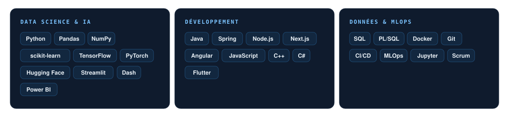

<p align="center">
  
</p>

<p align="center">
  <a href="https://www.linkedin.com/in/adam-hassen-06922b170/"></a>
  <a href="https://huggingface.co/adam5858"></a>
  <a href="mailto:adam.hassen941@gmail.com"></a>
</p>

## À propos

```python
class AdamHassen:
    formation   = ["ESPRIT · Data Science", "ENSIM · Interaction Personnes-Systèmes"]
    en_ce_moment = "IA appliquée à l'assurance : petits LLMs locaux, RAG, Machine Learning"
    recherche   = "Stage de fin d'études en Data Science, Machine Learning ou IA générative"
    interets    = ["RAG", "évaluation de LLMs", "séries temporelles", "qualité des données"]
    base        = "Le Mans, mobile partout en France"

    def philosophie(self):
        return "Un modèle ne vaut que ce que valent ses données, et il doit servir à quelqu'un."
```

## Projets phares

<p align="center">
  
  
</p>
<p align="center">
  
  
</p>

## Stack technique

<p align="center">
  
</p>
<p align="center">
  
</p>

## Mes contributions

<picture>
  <source media="(prefers-color-scheme: dark)" srcset="https://raw.githubusercontent.com/adam-hassen/adam-hassen/output/github-snake-dark.svg"/>
  <source media="(prefers-color-scheme: light)" srcset="https://raw.githubusercontent.com/adam-hassen/adam-hassen/output/github-snake.svg"/>
  
</picture>

<p align="center">
  
</p>
